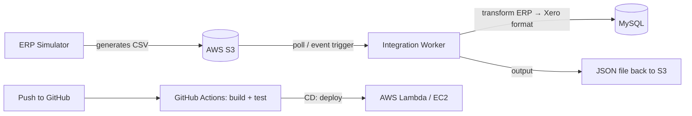

# ERP ↔ Finance Integration Pipeline

[](https://github.com/mia724430/erp-finance-integration/actions/workflows/ci.yml)

Simulates an automated data integration pipeline between an ERP system and a finance system (Xero format) — the kind of "glue" that keeps two enterprise systems in sync without manual CSV exports/imports.

> **Status: Week 1 complete** — Full local pipeline: generate → poll → parse → transform → dedupe → persist to MySQL → JSON output, with structured logging, unified error handling, and CI running build + test on every push. Week 2 (AWS) is next.

## Why this project

In most companies, the ERP system (orders, purchasing, inventory) and the finance system (invoices, receivables/payables) are two separate pieces of software that don't talk to each other automatically. The common workaround is manual export/import — slow, error-prone, and it delays things like month-end close.

This project simulates the real-world fix: an automated pipeline that polls a data source on a schedule, picks up new records, transforms them into the target system's format, and delivers them — with logging and error handling at every step.

Built as a portfolio project while transitioning from a supply chain background into software engineering — the goal is to demonstrate both an understanding of real enterprise data problems and the ability to implement the engineering solution end to end (including CI/CD and cloud deployment).

## Architecture



*(Week 1 runs this locally — a folder on disk stands in for S3, and MySQL runs in Docker. AWS wiring lands in Week 2.)*

## Tech stack

| Layer | Technology |
|---|---|
| Core language | C# / .NET 10 |
| Cloud storage | AWS S3 |
| Database | MySQL (via EF Core) |
| Scheduled job | .NET Worker Service (`BackgroundService`) |
| CI/CD | GitHub Actions |
| Cloud deploy | AWS Lambda + EventBridge (MVP) |
| Logging | Serilog |
| Testing | xUnit |

## Project structure

```
erp-finance-integration/
├── src/
│   ├── ERP.Simulator/          # generates fake ERP invoice/order data
│   ├── Integration.Worker/     # core worker service (poll + transform)
│   ├── Integration.Core/       # shared models and business logic
│   └── Integration.Data/       # EF Core data access layer
├── tests/
│   └── Integration.Tests/      # xUnit tests
├── .github/workflows/          # CI/CD pipeline definitions
├── infrastructure/aws/         # AWS configuration
└── docker-compose.yml          # local MySQL for development
```

## Running locally

Start the local MySQL container, generate some fake invoices, then run the worker:

```bash
docker compose up -d                       # starts MySQL on localhost:3307
dotnet run --project src/ERP.Simulator     # writes a CSV batch to data/incoming/
dotnet run --project src/Integration.Worker
```

> Host port **3307** (not the default 3306) is used for the container, since a machine already running a native MySQL server on 3306 would otherwise conflict. Change this in `docker-compose.yml` and the `ConnectionStrings:MySql` value in `src/Integration.Worker/appsettings.json` if you'd rather use a different port.

Each `ERP.Simulator` run generates a batch of 5–15 fake invoice/order records and writes them as a CSV to `data/incoming/` at the repo root (a stand-in for the S3 bucket during Week 1; the folder is gitignored and created automatically). The records include a bit of realistic messiness — stray whitespace, inconsistent currency casing — that the transform step cleans up.

`Integration.Worker` polls `data/incoming/` every 5 seconds. For each CSV file it finds, it:

1. Parses the rows into `ErpInvoice` records.
2. Transforms each into a Xero-format `XeroInvoice` (trimming/title-casing customer names, uppercasing currency codes).
3. Saves the batch to MySQL (schema applied automatically via EF Core migrations on startup).
4. Writes the same batch out as a JSON file to `data/output/`.
5. Moves the source CSV into `data/processed/` so it isn't picked up again.

Both `ERP.Simulator` and `Integration.Worker` log via Serilog to the console and to a rolling daily file under `logs/` at the repo root.

**Error handling:** if a file fails anywhere in that pipeline (malformed CSV, DB error, a genuine data conflict — see below), the Worker logs the full exception and moves *that file* to `data/failed/` instead of `processed/`; any other files picked up in the same poll cycle are unaffected, and the Worker keeps polling on the next cycle rather than crashing. There's no automatic retry (a known, documented limitation below); a failed file needs a human to look at it.

**Duplicate handling:** invoice numbers are checked at two levels before anything is saved. Within a single file, an exact repeated row is skipped (logged as a warning) and kept once; a row that shares an invoice number with an earlier row but has *different* content (amount, customer, date, or currency) is treated as a data error and fails the whole file, rather than silently picking one version. Across files — e.g. if a file gets reprocessed after a crash between the DB save and the file being marked done — invoices already saved to MySQL are detected and skipped as a no-op, backed by a unique index on `InvoiceNumber` as a database-level safety net.

## Testing

23 unit tests (`dotnet test`), all pure — no database or Docker required to run them:

- **`ErpInvoiceTransformerTests`** — ERP→Xero field mapping and cleaning (whitespace, casing, currency, rounding).
- **`ErpInvoiceGeneratorTests`** — the simulator produces one invoice per reserved order number, correctly.
- **`InvoiceDeduplicatorTests`** — cross-file duplicate detection against already-saved invoices.
- **`IntraFileDuplicateResolverTests`** — within-file exact duplicates vs. genuine conflicts.

## CI/CD

GitHub Actions (`.github/workflows/ci.yml`) runs `dotnet build` and `dotnet test` on every push and pull request to `main`. Full automated deploy to AWS lands in Week 3.

## Scope and honest limitations

This is a portfolio MVP, not a production integration:

- Simulated data, not a real Xero API integration
- One-way sync only (ERP → Finance)
- No automatic retry — failures are logged, not retried
- No frontend/dashboard — verified via logs and database queries

## Roadmap

- [x] Week 1: local pipeline (simulator → worker → transform → MySQL/JSON), fully working end to end
- [ ] Week 2: swap local folder for AWS S3, add EventBridge-triggered processing
- [ ] Week 3: GitHub Actions CI/CD, automated deploy to AWS
